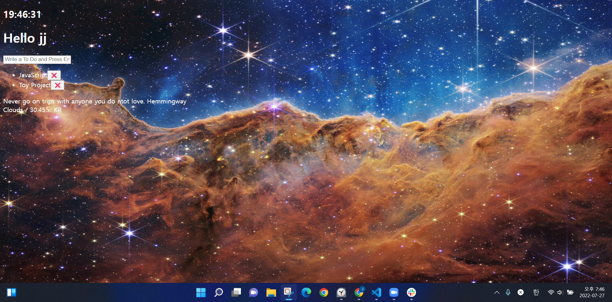

## JavaScript 보충 공부 repository 입니다.

- 노마드 코더

  - [바닐라 JS로 크롬 앱 만들기](https://nomadcoders.co/javascript-for-beginners)  
    

- 드림코딩

  - [자바스크립트 12. 프로미스 개념부터 활용까지 JavaScript Promise | 프론트엔드 개발자 입문편 (JavaScript ES6)](https://www.youtube.com/watch?v=JB_yU6Oe2eE)

- Web Dev Simplified

  - [How To Create A Search Bar In JavaScript](https://www.youtube.com/watch?v=TlP5WIxVirU)

- GeekProbin

  - [Movie Search App Using OMDb API | Vanilla JavaScript Project](https://www.youtube.com/watch?v=1VjdxCTBfUI)

- Florin Pop

  - [PokeDex - JavaScript Tutorial](https://www.youtube.com/watch?v=XL68br6JyYs)
  - [Infinite Scrolling with JavaScript](https://www.youtube.com/watch?v=L8X4zAsoxb4)
